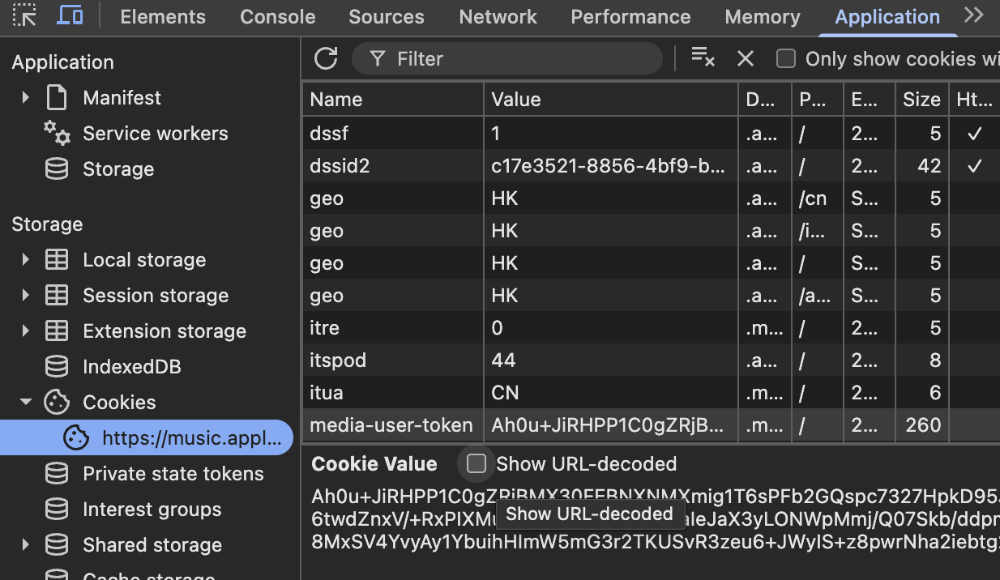

## 准备工具

1. 一台 PC ，macOS 12+ 或 Windows ，CPU 性能越高越好

2. BT 下载器，推荐 `qBittorrent`

3. AI ，辅助理解

## 软件介绍

`Roon` 自身有网播、多设备管理等丰富功能，但配合 `HQPlayer` 在 PCHiFi 本地环境下使用时，基本只作为一个**外观现代、易于操作**的图形界面（你不会想用 `HQPlayer` 找专辑或者切歌的）

`HQPlayer` 简单来说是一款强大的**升频器**，提供丰富的 `滤波/抖动/调制` 选择，能有针对性地提升解码性能

## 下载

```bash
magnet:?xt=urn:btih:650FB22C46EDF10E151AF60860340FC2FA8116F6&dn=Roon 2.65.1653
```

```bash
magnet:?xt=urn:btih:02285FC7F175AEDEAA5066AFDC43248B79631129&dn=HQPlayer Desktop 5.17.1
```


```zsh
container system start
container run -v /Users/你的用户名（在finder里看，就是Desktop的上一级）:/app/rootfs/data -e args="-L 你的 Apple ID 邮箱:密码 -F" --rm ghcr-pull.ygxz.in/itouakirai/wrapper:arm
/* 把中文替换为你相应的内容 */
```

## 2FA 验证码登录

有较大可能你的 Apple 设备（不一定是电脑）会弹出一条信息说“你的 Apple ID 在新设备登录”然后显示一个 6 位验证码，此时先不要把验证码弹窗关掉。**新打开一个终端窗口**

```zsh
echo -n 6位验证码 > /Users/你的用户名/2fa.txt
```

当前一个终端窗口显示 `response type 6` ，就可以**关闭所有终端窗口**，最核心的一步已经完成。

## 简化流程

新开一个 `Terminal` 窗口，复制黏贴以下内容，等待运行终止后关闭窗口

```zsh
container system start
container run --name am-wrapper -v /Users/你的用户名:/app/rootfs/data -p 10020:10020 -p 20020:20020 -e args="-M 20020 -H 0.0.0.0"  ghcr-pull.ygxz.in/itouakirai/wrapper:arm
```

## 一键启动脚本

在**桌面**创建一个文件 `AM启动.txt` ，然后复制粘贴。**完成后把`.txt`改成`.sh`**

```zsh
#!/bin/zsh
container system start
container start am-wrapper 
osascript -e '
  tell application "Terminal"
    activate
    do script "cd ~/apple-music-downloader && clear && echo \"已进入 apple-music-downloader 目录\""
  end tell
'
```

原版教程中想要下载必须得输入 `go run main.go <url>` ，非常麻烦，所以我让 AI 写了一个函数实现在 `apple-music-downloader` 目录下输入 url 回车后自动添加 `go run main.go` 。

用 `Finder` 打开 `/Users/你的用户名` ，键盘按 `command + shift + 句号` 会显示隐藏文件，找到 `.zshrc` 并双击打开，在最后加上如下内容。

```zsh
chpwd() {
  if [[ $PWD == $HOME/apple-music-downloader* ]]; then
    [[ -f .zshrc ]] && source .zshrc
  fi
}
```

将修改好的 `.zshrc` 复制一份到 `/Users/你的用户名/apple-music-downloader` ，并将里面内容全部替换为如下并保存。

```zsh
autoload -Uz add-zsh-hook
function auto_go_run() {
  if [[ $BUFFER == http* ]]; then
    BUFFER="go run main.go $BUFFER"
    zle accept-line
  fi
}
zle -N auto_go_run
bindkey '^M' auto_go_run   # 回车键触发（Enter）
```

至此，整个下载流程就被简化为两步：

1. 双击 `AM启动.sh` ，应当会先启动 `am-wrapper` ，然后再弹出一个新的 Terminal 窗口
2. 在第二个 `Terminal` 窗口中直接复制粘贴 Apple Music 的网址，然后回车

> 注意：只需保留 `Album/Song ID` ，如 <https://music.apple.com/cn/album/オリジナルサウンドトラック-英雄伝説vi-空の軌跡/502445161> 中间日文应当全部删除再复制，只需保留 <https://music.apple.com/cn/album/502445161> 否则可能报错。
>
> 日文歌曲可以尝试将 `music.apple.com/**cn**` 改为 `music.apple.com/**jp**` 可能可以避免显示罗马音，前提是 `Storefronts` 中有 Japan
>
> 推荐 `Chrome` 通过 `Tampermonkey/Violentmonkey` 安装 `Ame` 插件 <https://gitlab.com/SuperSaltyGamer/ame/-/raw/main/dist/applemusic.user.js> 从而在 AM 网页端查看 `Storefronts` 和音乐规格（如 24bit 48khz）

## 下载设置

建议使用 `VScode` 等软件打开 `/Users/你的用户名/apple-music-downloader` 文件夹中的 `config.yaml` ，根据作者的提示修改即可。

第一条 `media-user-token` 的获取方式需要你在 `Chrome` 中登录 Apple Music ，然后在任意界面鼠标右键 inspect（审查元素），找到 `media-user-token` 后把那一大串复制粘贴到 `config.yaml` 对应位置



追求最高音质，有几条内容是需要注意的：

```zsh
embed-lrc: true
max-memory-limit: 1024 # MB
get-m3u8-from-device: true
#set 'all' to retrieve all m3u8, and set 'hires' to only detect hires m3u8.
get-m3u8-mode: hires # all hires
aac-type: aac-lc # aac-lc aac aac-binaural aac-downmix
alac-max: 192000  #192000 96000 48000 44100
atmos-max: 2768  #2768 2448
```

如果你不喜欢 `ALAC` 编码的 `.m4a` 文件，原作者也在最下面提供了 `ffmpeg` **无损转换** `.wav` 的功能：

```zsh
convert-after-download: true     # Enable post-download conversion (requires ffmpeg)
convert-format: "wav"            # flac | mp3 | opus | wav | copy (no re-encode)
```

## 管理容器

开一个窗口（拉长一点），复制粘贴以下内容

```zsh
container ls -a
```

你应该可以看到一个表格，`ID` 为 `am-wrapper` , `STATE` 为 `running` 。通过以下命令可以暂停这个容器（建议下载完音乐之后养成 **stop** 的习惯）

```zsh
container stop am-wrapper
```

注意：有的时候音乐下载会报错，那么就需要 `stop` ，然后再运行 `AM启动.sh`

> Reference: <https://applemusic.mintlify.app/amdl/quickstart/macos>
>
> Windows 使用 `WSL`| 推荐 Reference: <https://blog.karune.icu/2025/06/04/am_linux/>
