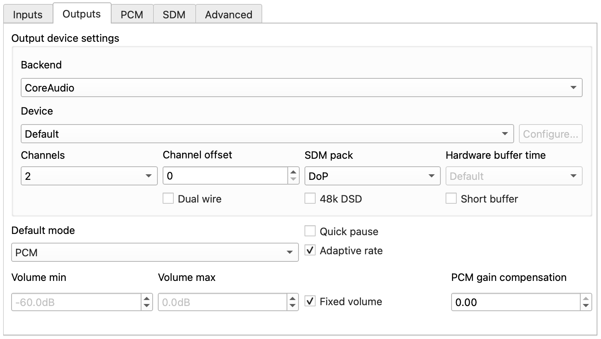
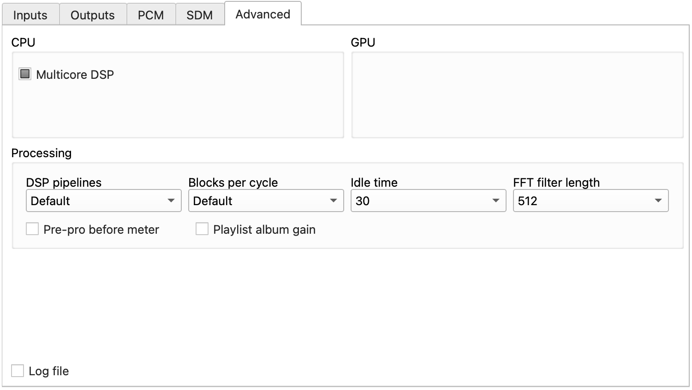
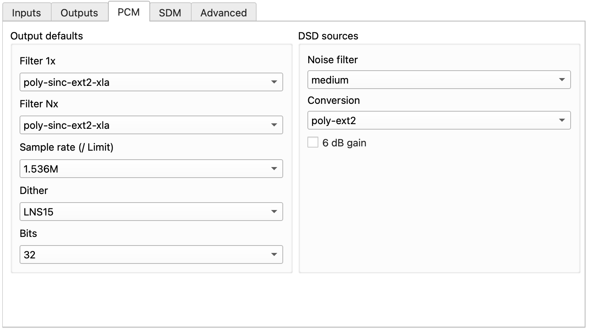
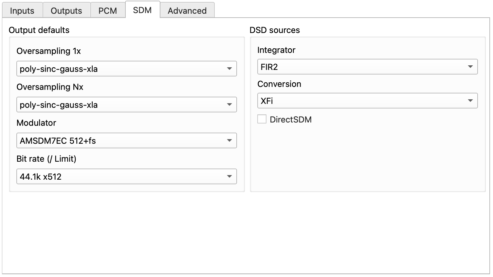

## 准备工具

1. 一台 PC ，macOS 12+ 或 Windows ，CPU 性能越高越好

2. BT 下载器，推荐 **qBittorrent**

## 软件介绍

**Roon** 自身有网播、多设备管理等丰富功能，但配合 **HQPlayer** 在 PC-HiFi 本地环境下使用时，基本只作为一个**外观现代、易于操作**的图形界面（你不会想用 HQPlayer 找专辑或者切歌的）

**HQPlayer** 简单来说是一款强大的**软件 DSP（数字信号处理器）**，提供丰富的**升频/滤波/抖动/调制/卷积**选择，能有针对性地提升解码素质

## 下载

Roon 2.65(1653)：

```bash
magnet:?xt=urn:btih:650FB22C46EDF10E151AF60860340FC2FA8116F6&dn=Roon 2.65.1653
```

HQPlayer Desktop 5.17.1:

```bash
magnet:?xt=urn:btih:02285FC7F175AEDEAA5066AFDC43248B79631129&dn=HQPlayer Desktop 5.17.1
```

## Roon to HQPlayer 设置

Roon: Settings -> Setup -> Add HQPlayer ，然后底部 `Select an audio zone` 选择 HQPlayer

HQPlayer: 单击主界面左侧边栏最下面一个按钮（形似两方块用一曲线连接），使其保持选中状态

## HQPlayer 推荐配置

> 如果时间充足，请务必认真阅读 `hqplayer5desktop-manual.pdf` 。作者针对每个配置选项有详尽介绍，可喂给 AI 辅助理解，一定会有所收获。



`Backend` PC-HiFi 不用网播（ NAA ）的话选择 `Coreaudio｜macOS` / `WASAPI、ASIO（更推荐）｜Windows`

`Device` 选择你的解码/界面名称

`SDM pack` 如果选择 SDM 升频（DSD）就选择 `DoP` ，否则 `none`

`48k DSD` 解码支持的话可以开

`Default mode` 有三种：`PCM` 只输出 PCM （会把 DSD 转 PCM ），`DSD` 只输出 DSD （会把 PCM 转 DSD ），`source` 则是 PCM 升 PCM ，DSD 升 DSD

> R2R DAC 可能无原生支持 DSD ，这种情况下才需 DSD 转 PCM ，其他情况下建议选择 `source` 或 `DSD`

`Adaptive rate` 意思是对 44.1khz 基频选择整数或非整数倍（如 44.1khz -> 768khz ）升频，推荐 PCM 升频时打勾，DSD 升频时关闭（因为大部分解码不支持 48k DSD ）

`Fixed Volume` 推荐打勾，相当于 -3dB gain ，提供一定 headroom 动态余量，防止 clipping 削波以及一些渣录混音源在升频后可能发生的爆音；如果不希望数字音量衰减导致有效Bit减少/动态压缩（其实 -3dB 很轻微），请设为 0dB ；如果前端系统只有数字音量衰减，可以考虑使用 HQPlayer 界面的旋钮作为音量控制

`PCM gain compensation` 用于降低 PCM 音量从而和 DSD 达到一致，建议设 0 ，有需要可以根据 `manual.pdf` 中的表格设置



这一页如图设置即可，若有性能压力可以把 GPU 部分 `CUDA Offload` 打勾；`Idle time` 不要设置为 0 ，否则可能卡顿/爆音，30s 是比较合适的。



PCM 和 SDM 的 `Filter` 滤波设置统一在后文介绍。

`Sample rate (/Limit)` 推荐设置为 DAC 支持的最高规格，若遇性能瓶颈或者觉得高频太多可以向下调整。

`Dither` 在采样率为 384khz 及以上时，推荐设为 LNS15 ；在 192khz 及以下时建议查阅 `manual.pdf`

`Bits` 同样推荐设为 DAC 支持的最高规格；特别地，R2R DAC 可以设为**有效 Bits** 减少过零失真， `manual.pdf` 中给出了部分 R2R 品牌的设置供参考。低 Bits 主观听感上超高频少点，瞬态慢点，结像更厚

图中右侧 DSD 转 PCM 有需求请自行查阅 `maunal.pdf`



应当明确，对 SDM 来说 `Modulator` 调制方式比 `Bit rate` 更重要。

其中，7 阶调制器比 5 阶调制器性能更好，HQPlayer 作者只推荐 ESS 芯片 DAC 考虑使用 5 阶。

笔者推荐 DSD 256 及以下使用 `ASDM7EC-super` ，DSD 512 使用 `ASDM7EC-super 512+fs` 或 `AMSDM7EC 512+fs` ；如遇到性能瓶颈可换 `ASDM7EC-fast(512+fs)`

`Bit rate` 设为 DSD 256 已经足够，若性能还有余裕再尝试 DSD512

建议勾选 `Direct SDM` ；不勾选的情况下，DSD 也会升频至更高 DSD ，使用默认设置即可

## Filter 滤波推荐

> 将 `manual.pdf` 喂给 AI 分析，对滤波选择很有帮助！你可能需要了解的概念：最小/线性相位、频域/时域响应、振铃、高频滚降、（阻带）衰减陡度、（奈奎斯特）截止频率、切趾、抽头数、高斯窗、带外噪声、混叠……

`Filter 1x` 针对 44.1/48khz 的音源，`Filter Nx` 针对更高采样率的 Hi-Res 音源，可以尝试名称中带有 hires 的滤波，但一般推荐和 `Filter 1x` 设为同一个。

笔者一共推荐 3 个大类：

### poly-sinc-ext2 系列

  该系列在 Nyquist 频率处完全截止，能极其有效地抑制带外噪声和混叠失真；主观听感上音色自然，有“模拟味”，且有多档变体适配不同需求，例如：

  -short：减少振铃，瞬态更好

  -medium：平衡长度与滚降速度

  -long / -xla：极长抽头，滤波质量极高，提升解析

  -hires：对 HiRes 和 MQA/MP3 源优化，极高阻带衰减，同时清理编码噪声。

### poly-sinc-gauss 系列

  该系列优化了瞬态响应，使得音头音尾都能清晰分离，应对快节奏音乐更佳；同样有许多变体。

### sinc 系列

  sinc-S/M/Mx 是 poly-sinc-ext2-xla 的变体

  sinc-MGa 是 poly-sinc-gauss-xla 的变体

  sinc-L 是主打超高抽头数、CPU 性能开销最大的滤波，主观听感上解析、线条感强，声场开阔，适合古典

  sinc-Lh 是 sinc-L 的低性能要求版本

## Convolution & Pipeline 设置

这两项在菜单栏里，前者是**卷积**功能，音箱房间校准可能会用到，笔者没有用过；后者是 EQ 功能以及 Crossfeed（交叉互馈），如果需要减少耳机头中效应可以试试 Crossfeed

## Tips

以下是笔者在长时间使用 HQPlayer 之后的一些心得

### 为什么要使用 HQPlayer

现代 DAC 大多内置升频（ Oversampling ，简称 OS）、1bit 调制、噪声整形等等算法处理数字信号，从而实现高性能指标。

HQPlayer 的理念是利用高性能电脑 CPU 做外置的数字处理，以实现更灵活、更复杂的算法处理，从而提高 DAC 的上限。

### 如何有效利用 HQPlayer

由于 HQPlayer 的本质是取代 DAC 的 **OS** 功能，所以配合带有 **NOS**（非过采样）的 DAC 是最好的，比如这几年越来越流行的 **R2R** 。另外，虽然本文面向 PC-HiFi ，但 HQPlayer 还是使用**网播**最佳

当你理解 HQPlayer 的全部功能以及那些专有名词，并将其与主观听感挂钩之后，HQPlayer 就成为了一个稳定、可控、有限方向、几乎无成本的周边调整项；更进一步，你对于整套系统的优缺点会有更清晰的认知，对于减少了器材搭配的试错困难。
